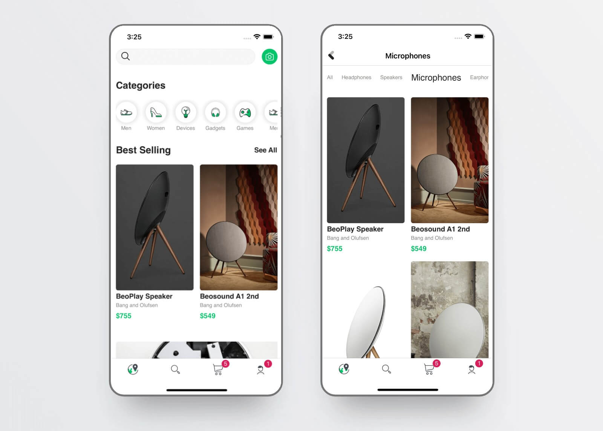
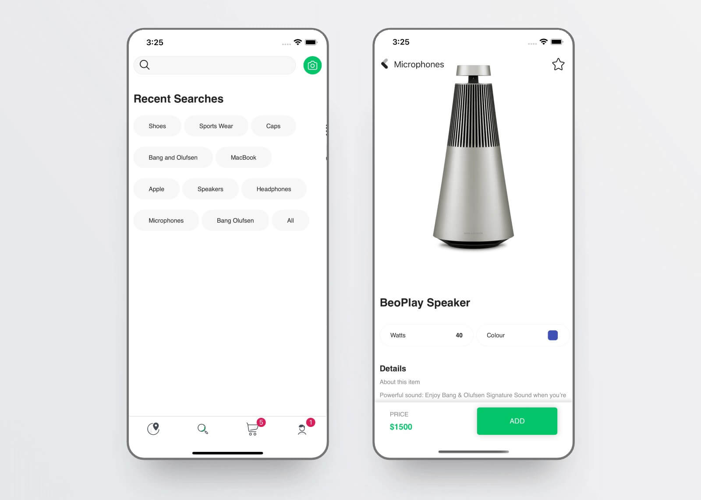

# Newline Course Branch

   

This branch is specifically for the **Newline** course that I have written on developing apps using React Native, from a Product perspective. It contains all the code that has been discussed in the course.

[The newline Guide to React Native for JavaScript Developers using TypeScript](https://www.newline.co/courses/the-newline-guide-to-react-native-for-javascript-developers)

> To know more about this template, go to the [master](../) branch.
___

#### The eCommerce App - From the course

|  | |
| :---------------------------------------------------: | :---------------------------------------------------: |

___

#### An opinionated [React Native](https://facebook.github.io/react-native/docs/getting-started) Starter Kit with [React Native Navigation](https://github.com/wix/react-native-navigation) + [Redux](https://github.com/reactjs/redux) + [Airbnb TSLint](https://github.com/airbnb/javascript) to build iOS and Android apps using [TypeScript](https://github.com/Microsoft/TypeScript-React-Native-Starter)

The project has been setup based off [RN Getting Started](https://facebook.github.io/react-native/docs/getting-started) and instructions from [Microsoft's Github TypeScript React Native Starter](https://github.com/Microsoft/TypeScript-React-Native-Starter) repo.

___

### Supports React Native 0.64.1, React Native Navigation v7, Flipper and Hermes

| Updates | RNN | RN | React | Comments |
|---|---|---|---|---|
|  May '21 | 7.14.0 | 0.64.1 | 17.0.1 | Update RN RNN, Hermes Support
|  Oct '20 | 7.1.0 | 0.63.3 | 16.13.1 | Support for Flipper
|  Apr '20 | 3.7.0 | 0.61.5 | 16.9.0 | Support for RN > 0.60, Android X
|  Nov '19 | 2.26.2 | 0.59.10 |  | Maintenance |
|  Mar '19 | 2.13.1 | 0.58.6 | 16.8.4 |

## Introduction

Jumpstart building robust apps using React Native and TypeScript with most commoly needed tools already setup. Just `yarn install` and get going from respective IDEs.

- Routing and Navigation
  - Tabbed navigation using [React Native Navigation v7](https://github.com/wix/react-native-navigation)
  - Side Menu support
- State Management using Flux Architecture
  - [Redux](https://redux.js.org/introduction/getting-started)
  - [Redux-Thunk](https://github.com/reduxjs/redux-thunk) middleware
- Widgets / Elements
  Build your own design system with these building blocks.
  - **elements**: `<BUTTON_DEFAULT>` or `<CText>`. They are custom elements that have default properties like font, size and so on.
  - **widgets**: Any component providing a complete functionality. E.g. carousels component, banner component, etc.
- Typography
  - Base Typography setup - Color, Font, LAYOUT, CTA, FONTS, TEXT, TEXT_INPUT
- Code Lint
  - [Airbnb's JS](https://github.com/airbnb/javascript) Linting

> _Disclaimer_: This is an **opinionated** approach to building apps with RN. The project structure is inspired by multiple production apps built by the contributors.
