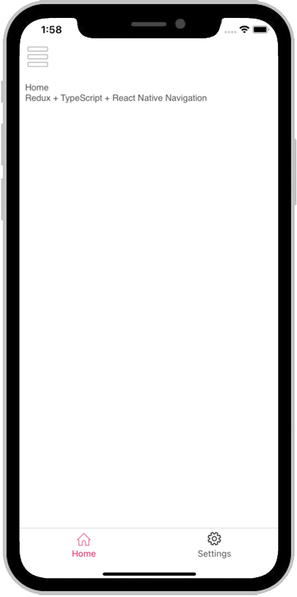

<div align="center">
  <br>
  
  <h1>🚀 Friday App 🚀</h1>
  <strong>Build enterprise React Native apps</strong>
</div>
<br />

# React Native Template - TypeScript

<div align="center">

 [](https://codeclimate.com/github/AmitM30/react-native-typescript-boilerplate)   [](./CONTRIBUTING.md)  

</div>

#### An opinionated [React Native](https://facebook.github.io/react-native/docs/getting-started) Starter Kit with [React Native Navigation](https://github.com/wix/react-native-navigation) + [Redux](https://github.com/reactjs/redux) + [Airbnb TSLint](https://github.com/airbnb/javascript) to build iOS and Android apps using [TypeScript](https://github.com/Microsoft/TypeScript-React-Native-Starter)

The project has been setup based off [RN Getting Started](https://facebook.github.io/react-native/docs/getting-started) and instructions from [Microsoft's Github TypeScript React Native Starter](https://github.com/Microsoft/TypeScript-React-Native-Starter) repo.

<p align="center">
  
</p>

___

### Supports React 17, React Native 0.66.0, React Native Navigation v7, Flipper and Hermes

Update (Nov 2021):
- Added Types (actions, reducers, store, components and more).
- Core API service using fetch
- Support for M1

| Updates | RNN | RN | React | Comments |
|---|---|---|---|---|
|  Nov '21 | 7.23.1 | 0.66.0 | 17.0.2 | Type definitions
|  May '21 | 7.14.0 | 0.64.1 | 17.0.1 | Update RN RNN, Hermes Support
|  Oct '20 | 7.1.0 | 0.63.3 | 16.13.1 | Support for Flipper
|  Apr '20 | 3.7.0 | 0.61.5 | 16.9.0 | Support for RN > 0.60, Android X
|  Nov '19 | 2.26.2 | 0.59.10 |  | Maintenance |
|  Mar '19 | 2.13.1 | 0.58.6 | 16.8.4 |

## Sponsor

I will keep supporting the projects that I have open sourced. If you have used any of my projects, for yourself or your business, I'd love your support through Github [sponsors](https://github.com/sponsors/AmitM30). You can also try to convince your employer to sponsor as a business.

## Introduction

Jumpstart building robust apps using React Native and TypeScript with most commoly needed tools already setup. Just `yarn install` and get going from respective IDEs.

- **Routing and Navigation**
  - **Native** Tabbed navigation using [React Native Navigation v7](https://github.com/wix/react-native-navigation)
  - Side / Drawer Menu support
- State Management using **Flux Architecture**
  - [Redux](https://redux.js.org/introduction/getting-started)
  - [Redux-Thunk](https://github.com/reduxjs/redux-thunk) middleware - side-effect handling
- **Atomic Design pattern**
  - The structure of the app is inspired by [atomic design pattern](https://atomicdesign.bradfrost.com/chapter-2/).
  - Widgets / Elements: Build your own **Design Language System** with these building blocks.
    - **Typography**: Base Typography setup - Color, Font, LAYOUT, CTA, FONTS, TEXT, TEXT_INPUT
    - **elements**: `<BUTTON_DEFAULT>` or `<CTEXT>`. They are custom elements that have default properties like font, size and so on.
    ```typescript
    <CTEXT style={GLOBAL.CTA.Style.primaryText}>{title}</CTEXT>
    ```
    - **widgets**: Any component providing a complete functionality. E.g. carousels component, banner component, etc.
    ```typescript
    <Category componentId={componentId} title={locale.Categories} />
    ```
- **Type Definitions**
  - Type definitons for actions, reducers, store, components and more.
- **Built-in Splash screen**
- **Hermes** and **Flipper** integrations
- **Code Lint**
  - [Airbnb's JS](https://github.com/airbnb/javascript) Linting

##### App Screens

|  |  | |
| :-------------------------------------------------------: | :---------------------------------------------------: | :---------------------------------------------------: |

##### Flipper Support


### Table of Contents

- [Project Structure](#project-structure)
- [Getting Started](#getting-started)
- [Cheat Sheet](#cheat-sheet)
  - [M1 support](#m1-support)
  - [Single Screen vs Tabbed Based Navigation](#single-screen-vs-tabbed-based-navigation)
  - [Renaming the App](#renaming-the-app)
  - [iOS Launch Screen](#ios-launch-screen)
  - [Android Launch Screen](#android-launch-screen)
- [Contributing](#contributing)
- [TODO](#todo)

### Project Structure

```
/
├── android						Android Native code
├── ios							iOS Native Code
├── shared
│   ├── redux					Applications Logic
│   │   ├── constants
│   │   ├── actions
│   │   ├── api
│   │   ├── reducers
│   │   ├── store
│   │   └── thunk
│   └── utilities
│   ├── services
│   │   ├── core				Core Services - API (fetch/axios), storage
│   │   │  ├── API
│   │   │  └── Storage
│   │   ├── home
│   │   └── search
├── src
│   ├── config					Global Configuration
│   ├── constants				Screen names and ids, Localization
│   ├── navigators				Router, Navigation
│   ├── view					UI compoments
│   │   ├── elements				Custom elements
│   │   ├── assets
│   │   ├── screens
│   │   ├── styles				Typography
│   │   └── widgets				Custom components
│   └── utilities
├── __tests__					Unit Tests
│   ├── presentation
│   └── redux
├── .babelrc
├── .gitignore
├── .travis.yml					Travis CI
├── tsconfig.json				TypeScript Configuration
├── tslint.js					TSLint configuration - extending AirBnb
├── tsconfig.json
├── app.json
├── index.js					Application Entry point
├── package.json
└── README.md
```

`shared`
Everything related to application business logic. The redux store.

`src`
Presentation layer for the app - screens, styles, images, icons etc.

### Getting Started

Make sure node version installed is `>=12.x.x`. Then install using yarn (or npm):
```
yarn install
```

Start the Metro Bundler:
```
yarn start
```

###### iOS

One time. Move to `ios` folder and install pods:

```
cd ios && pod install
```

Launch application from XCode (`Command + R`) Or launch from Terminal:

```
yarn ios
# runs the following command. change device name here
# `npx react-native run-ios --simulator='iPhone 11'`
```

###### Android

Start an Android Simulator from:
```
Android Studio > Tools > AVD Manager > Run any device
```

Similarly, run from Android Studio itself Or from Terminal:
```
yarn android
# runs the following command
# react-native run-android --variant=Debug
```

### Commands

|  | Remark |
|---|---|
| `yarn start` | Starts metro bundler |
| `yarn ios` | Starts iOS app. Start metro bundler first |
| `yarn android` | Starts Android app. Start metro bundler and Android emulator first |
| `yarn lint` | linting |
| `yarn lint:fix` | tries to fix linting issues automatically |
| `yarn build:android:debug` | Android debug build |
| `yarn build:android:release` | Android release build |

### Cheat Sheet

#### iOS Launch Screen

```shell
XCode -> Project Folder -> Click on `Images.xcassets` -> Click on `LaunchScreen`
```

Change the 3 images here to set the new launch screen for iOS.


#### Android Launch Screen

```shell
`./android/app/src/main/res/drawable-*` folders
```

Change the images the `drawable-*` folders to set the new launch screen for Android.

#### M1 support
Some additional steps may be required for project to work on M1.

  - Disable Rosetta in Terminal
  - Install ffi
```
sudo arch -x86_64 gem install ffi
```
  - Re-install dependencies
```
arch -x86_64 pod install
```
Now try and run CocoaPods.

P.S.: Thanks to samanthadotcom#7043 (discord)

#### Single Screen vs Tabbed Based Navigation

The application launches with a splash screen, and then moves to a tabbed based navigation. Splash screen is a good place to fetch data / build application launch logic like getting user token from API or Async Store, load persist state etc.

For Single screen application, replace this tabbed based navigation with a single screen - just `home`, or simply use the splash screen to setup the app, may be with a burger menu.

#### Renaming the App

You might also want to rename the app for your own use. Follow any of the links below.
- [How to Rename A React Native App](https://medium.com/the-react-native-log/how-to-rename-a-react-native-app-dafd92161c35)

Or

- NPM Package: [react-native-rename](https://www.npmjs.com/package/react-native-rename)

### Contributing

Please check out [Contributing](https://github.com/AmitM30/react-native-typescript-boilerplate/blob/master/CONTRIBUTING.md).

### Authors

- [**Anurag Chutani**](https://github.com/a7urag) - _Android Setup_
- [**Brian Varley**](https://github.com/BrianJVarley) - _Windows Setup_
- [**Nelson Omuto**](https://github.com/nelsonomuto) - _Update Podfile_

See also the list of [contributors](https://github.com/AmitM30/react-native-typescript-boilerplate/contributors).
